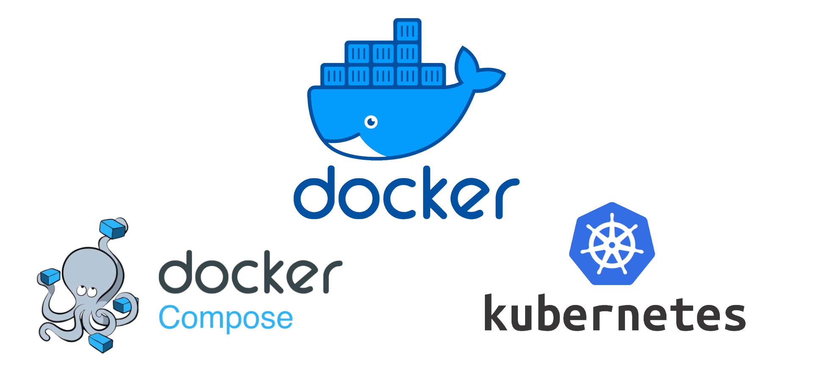

# Docker And Kubernetes
 

    

  The containarization technologies utilized

---

<!-- START doctoc generated TOC please keep comment here to allow auto update -->
<!-- DON'T EDIT THIS SECTION, INSTEAD RE-RUN doctoc TO UPDATE -->
## Table of Contents

- [Docker And Kubernetes](#docker-and-kubernetes)
  - [Table of Contents](#table-of-contents)
  - [Docker Compose](#docker-compose)
    - [Docker Containers](#docker-containers)
    - [Docker Networks](#docker-networks)
    - [Docker Volumes](#docker-volumes)
  - [Kubernetes](#kubernetes)

<!-- END doctoc generated TOC please keep comment here to allow auto update -->

---

## Docker Compose

    

 Docker Compose was used as the primary container orchestrator.

 Docker Compose allows us to define all the necessary deployment parameters, such as ports, volumes and image versions.

 It also allows us to manage, launch and stop all the containers at once.

---

### Docker Containers

    

 For the dockerization of our application, the following containers were defined:
  - Application (frontend)
  - Api Instance (multiple can be created at once)
  - Load Balancer
  - MongoDB
  - MariaDB

---

### Docker Networks

 Another advantage of docker compose is the ability to create multiple separate networks between containers.

 In our application the following networks were created:
  - frontend_network (App ⇄ Frontend Server)
  - backend_network (API Instances ⇄ Databases)
  - request_network (Load Balancer ⇄ API Instances)

---

### Docker Volumes

 Both MongoDB and the Cloud Service require the use of volumes mapped to the host's filesystem.

 In our application the following volumes were created:
  - mongodbdata (MongoDB Data)
  - file-bind (Bind volume that utilizes the host's filesystem, which is then managed by the cloud server)

---

## Kubernetes

    

 A Kubernetes K3s implementation was partially implemented, but would require more work to be put into it in order to be production ready.

 Since the final production environment will only consist of a single server, the kubernete's main feature of load balancing between machines would not be of any use.

 The final production version will include a kubernetes file which will launch the containers and do the appropriate load balancing, but more testing must be done in order to apply the changes to production. 